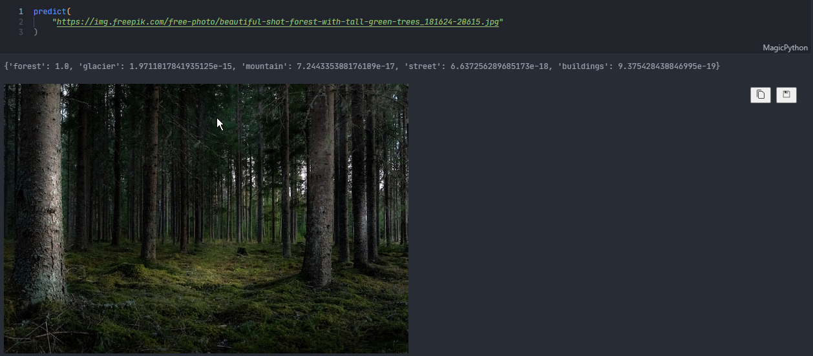
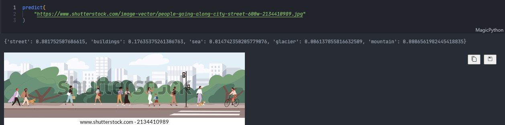
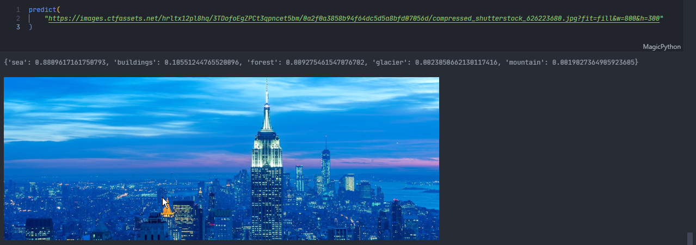
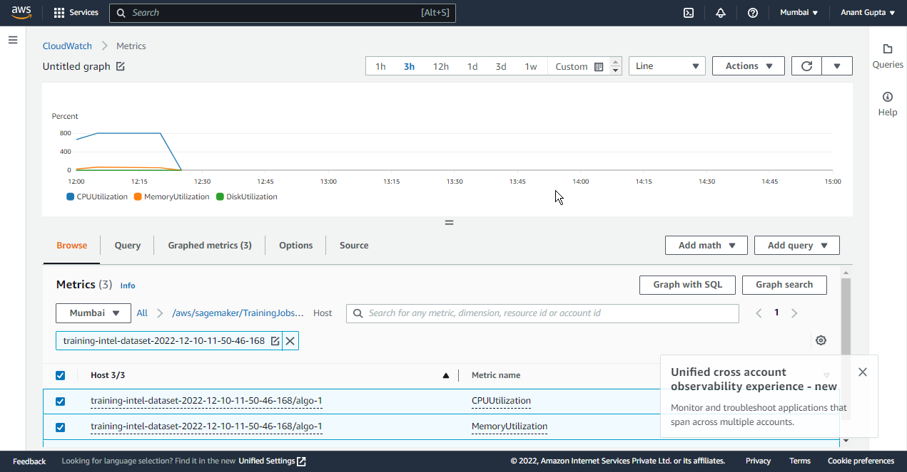

# AWS SageMaker

# TOC

- [AWS SageMaker](#aws-sagemaker)
- [TOC](#toc)
- [Assignment](#assignment)
- [Solution](#solution)

# Assignment

* You'll be doing what we did in the session but with a different dataset
* https://www.kaggle.com/datasets/puneet6060/intel-image-classification
* Use **Custom Docker Image** for all Sagemaker Jobs
  * Keep the Inference Container light weight
  * You don't need to create the image from scratch, rather just take one of the AWS DLC Image as Base
  * You will need these examples
    * https://docs.aws.amazon.com/sagemaker/latest/dg/build-your-own-processing-container.html
    * https://github.com/aws/amazon-sagemaker-examples/blob/main/advanced_functionality/pytorch_extending_our_containers/pytorch_extending_our_containers.ipynb
* Pre-Process dataset
  * Dataset: https://www.kaggle.com/datasets/puneet6060/intel-image-classification
    * Your dataset is already split into train and test
    * Resize the images to your model input size
    * Version the dataset with DVC
    * Push to S3
* Train Resnet18 from TIMM (Pretrained)
  * Use GPU Training
    * **Single GPU, Single Node**
* Save model evaluation metrics to a json file in sagemaker model directory
  * this would get uploaded to S3 automatically along with model artifacts
* Deploy Model to SageMaker inference endpoint
  * Resizing and Standardization of Input Image **must be in your inference script.**
  * You will only send the image as an array to the endpoint
  * **The response must be a dict of top 5 predictions along with confidence**
* Test endpoint with **2 example images each** from the classnames in the dataset
  * images can be taken from pred folder of the dataset, or from google images
* **Share the Notebook** with the above endpoint inference in notebook
  * It should include the preprocessing, training, deployment logs
  * It should also include the example images for testing along with their predictions
* Submit your training, preprocessing and inference scripts uploaded to Github
* Upload Tensborboard logs to Tensorboard Dev and share link to it

# Solution

- Custom Docker Image
  <details>
  <summary><b>Dockerfile:</b></summary>

  ```Dockerfile
  FROM 763104351884.dkr.ecr.us-east-1.amazonaws.com/pytorch-training:1.12.1-gpu-py38-cu113-ubuntu20.04-sagemaker

  COPY requirements.txt .
  RUN pip3 install -r requirements.txt

  ```
- [preprocessing data](preprocess.py)
- [training model](train.py)
- [infrencing](infer.py)
- [tensorboard dev logs](https://tensorboard.dev/experiment/BxMWktWVTyuOoLOf9ydTPA/)
- check complte training logs in training notebook [training logs](notebooks/03-train.ipynb)
  ```bash
  Epoch 4: 100%|██████████| 57/57 [04:41<00:00,  4.94s/it, loss=0.061, v_num=0, train/loss=0.0397, train/acc=0.980, val/loss=0.527, val/acc=0.896]
  Testing: 0it [00:00, ?it/s]
  Testing:   0%|          | 0/10 [00:00, ?it/s]
  Testing DataLoader 0:   0%|          | 0/10 [00:00, ?it/s]
  Testing DataLoader 0: 100%|██████████| 10/10 [00:17<00:00,  1.74s/it]
  Testing DataLoader 0: 100%|██████████| 10/10 [00:17<00:00,  1.74s/it]
  ┏━━━━━━━━━━━━━━━━━━━━━━━━━━━┳━━━━━━━━━━━━━━━━━━━━━━━━━━━┓
  ┃        Test metric        ┃       DataLoader 0        ┃
  ┡━━━━━━━━━━━━━━━━━━━━━━━━━━━╇━━━━━━━━━━━━━━━━━━━━━━━━━━━┩
  │         test/acc          │    0.8896281719207764     │
  │         test/loss         │    0.5668848156929016     │
  └───────────────────────────┴───────────────────────────┘
  {'buildings': 26.582279801368713, 'forest': 38.349515199661255, 'glacier': 31.151241064071655, 'mountain': 27.692309021949768, 'sea': 37.79904246330261, 'street': 30.092594027519226}
  :: Saving Scripted Model
  ```

- view all infrecing results in [ploy notebook](notebooks/04-deploy.ipynb)
  
  
  

- system utilization
  